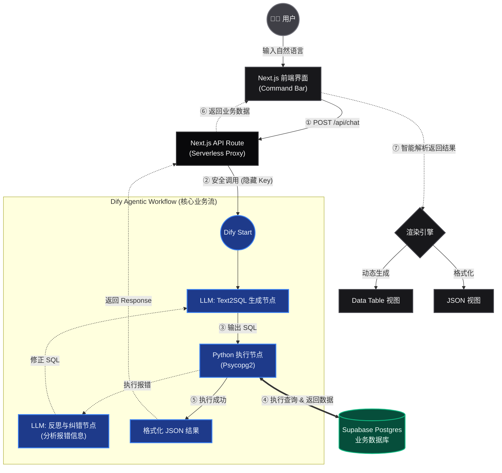

# DataLens：自然语言数据查询终端

用中文提问，经 Dify 工作流生成 SQL、连接 Supabase 执行查询，并在网页上以表格展示结果。SQL 执行失败时，工作流会根据报错信息自动修正并重试。

**实现要点**
- **Text2SQL + 反思纠错**：在 Dify 中编排「生成 SQL → Python 执行 → 报错则反思修正」流程（工作流需在 Dify 侧配置，本仓库提供前端与调用接口）
- **安全调用**：Next.js API Route 转发 Dify 请求，API Key 仅保存在服务端环境变量
- **演示数据**：`mock_data_generator.py` 在 Supabase 创建 users / products / orders 三表并写入测试数据
- **结果展示**：前端解析返回 JSON，支持表格与 Raw JSON 视图

**在线体验**：[Vercel Demo](https://datalens-text2sql-agent.vercel.app) · **演示视频**：[Bilibili](https://www.bilibili.com/video/BV1szXaBhEmG/)

> 说明：本仓库包含 Next.js 前端与数据脚本；Text2SQL 与反思逻辑在 Dify 工作流中实现，本地运行需自备 Dify API Key 及已导入的工作流

**在线视频演示：**

[](https://www.bilibili.com/video/BV1szXaBhEmG/)

## 核心特性 (Key Features)

* **Agentic Workflow 与反思纠错 (Reflection)**：打破传统单向 Text2SQL 极高的失败率。当生成的 SQL 语法错误或执行报错时，Agent 会自动提取错误日志，进入 **"反思节点"** 重新生成修正后的 SQL，直至成功获取数据（设有最大重试防死循环机制）。
* **Serverless 安全架构**：摒弃前端直接调用大模型 API 的危险做法，通过 Next.js API Routes (Serverless Functions) 搭建中转代理，将 Dify API 密钥安全封装在后端环境变量中。
* **智能数据渲染引擎**：前端自带健壮的数据解析器，无论后端返回的是纯 JSON 数组还是嵌套的字符串化 JSON，都能自动提取并渲染为 **Data Table** 和 **Raw JSON 面板**。
* **SaaS 级交互体验**：采用类似 Vercel / Linear 的高级暗色主题 (Zinc Palette)，内置 Command Bar、毛玻璃吸顶表头 (Backdrop-blur) 与微交互动效。

## 系统架构 (Architecture)

本项目采用前后端分离与大模型工作流编排解耦的架构设计：



## 技术栈 (Tech Stack)

* **前端 (Frontend)**: React, Next.js 15 (App Router), Tailwind CSS v4
* **AI 编排 (LLMOps)**: Dify.ai
* **大模型 (LLM)**: Qwen
* **数据库 (Database)**: Supabase (PostgreSQL)
* **数据构造脚本**: Python 3, Faker
* **部署环境 (Deployment)**: Vercel

## 项目结构 (Project Structure)

```text
DataLens-Text2SQL-Agent/
├── backend_assets/              # 后端资产与脚本
│   ├── venv/                    # Python 虚拟环境
│   └── mock_data_generator.py   # 连接 Supabase 生成电商测试数据的 Python 脚本
│
├── frontend/                    # Next.js 独立前端工程 (Vercel 部署根目录)
│   ├── app/
│   │   ├── api/chat/route.ts    # 后端 API 路由 (处理与 Dify 的安全通信)
│   │   ├── globals.css          # Tailwind CSS 全局变量与定制滚动条
│   │   ├── layout.tsx           # 根布局
│   │   └── page.tsx             # 核心 UI 组件 (Search, Table, JSON Toggles)
│   ├── public/                  # 静态资源
│   ├── next.config.ts           # Next.js 配置
│   └── package.json             # 前端依赖
│
└── README.md                    # 项目说明文档
```

## 快速开始 (Getting Started)

如果你想在本地运行此项目进行二次开发：

**1. 准备环境**
确保你已安装 Node.js (v18+) 和 npm。

**2. 克隆项目**

```bash
git clone https://github.com/Daphne502/DataLens-Text2SQL-Agent.git
cd DataLens-Text2SQL-Agent/frontend
```

**3. 安装前端依赖**

```Bash
npm install
```

**4. 配置环境变量**
在 frontend 目录下创建一个 .env.local 文件，填入你的 Dify API 凭据：

```env
# Dify 工作流 API 密钥
DIFY_API_KEY=app-xxxxxxxxxxxxxxxxxxxxxx
# Dify 接口地址 (默认为官方云服务)
DIFY_API_URL=https://api.dify.ai/v1
```

**5. 启动开发服务器**

```Bash
npm run dev
```

打开浏览器访问 `http://localhost:3000`, 即可看到 DataLens 控制台界面。

## 部署 (Deployment)

本项目专为 Vercel 优化，支持一键部署：

1. 在 Vercel 中导入本 GitHub 仓库。
2. 将 Root Directory 设置为 frontend。
3. 在 Environment Variables 中添加 DIFY_API_KEY 和 DIFY_API_URL。
4. 点击 Deploy 即可。

## 许可证 (License)

本项目采用 MIT License 开源。

---
*Powered by Next.js & Agentic Workflow.*
